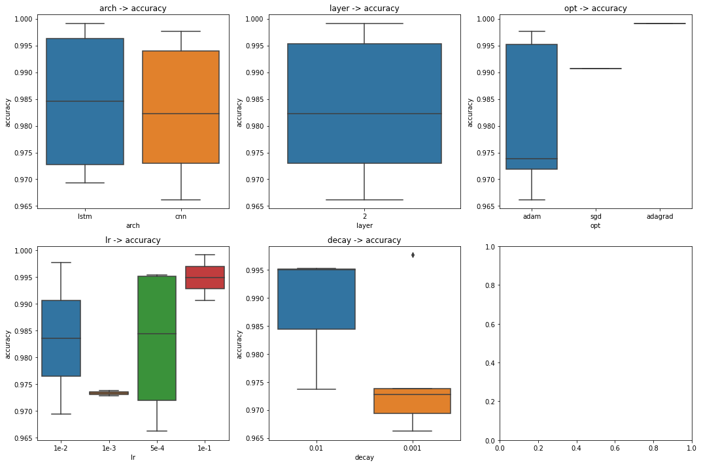

# Advanced Usage


## Result Extraction

You can extract results (`accuracy`, `F-1`, `BLEU`, etc. ) from generated logs by writing simple rules. 

Try: 

`manytasks show tasks --rule rule`

where the `rule.yaml` looks like:

```yaml
bleu:
  filters:
    include: valid on 'valid' subset
  pattern: bleu <FLOAT>
  reduce: max
loss:
  filters:
    include: valid on 'valid' subset
  pattern: loss (\d*.\d*)
  reduce: min
```

You will get:

```
  idx  cmd                                                                                      bleu      loss
-----  -----------------------------------------------------------------------------------  --------  --------
    0  python main.py wmt14 --arch lstm --layer 2 --opt adam --lr 1e-2 --decay 0.01         nan       nan
    1  python main.py wmt14 --arch lstm --layer 2 --opt adam --lr 5e-4 --decay 0.01          25.2239    0.1586
    2  python main.py wmt14 --arch transformer --layer 2 --opt adam --lr 1e-2 --decay 0.01   19.8578    0.3370
    3  python main.py wmt14 --arch transformer --layer 2 --opt adam --lr 5e-4 --decay 0.01   21.1514    0.2932
    4  python main.py wmt14 --arch lstm --layer 2 --opt sgd --lr 1e-1                       nan       nan
    5  python main.py wmt14 --arch lstm --layer 2 --opt adagrad --lr 1e-1                    21.8467    0.2697
    6  python main.py wmt14 --arch transformer --layer 2 --opt sgd --lr 1e-1                 16.8448    0.4381
    7  python main.py wmt14 --arch transformer --layer 2 --opt adagrad --lr 1e-1             17.8604    0.4042
```

## Plotting Curves

See `examples/python/analyze_log.ipynb` for details.


- Factor Analsis

See `examples/python/analyze_log.ipynb` for details.



