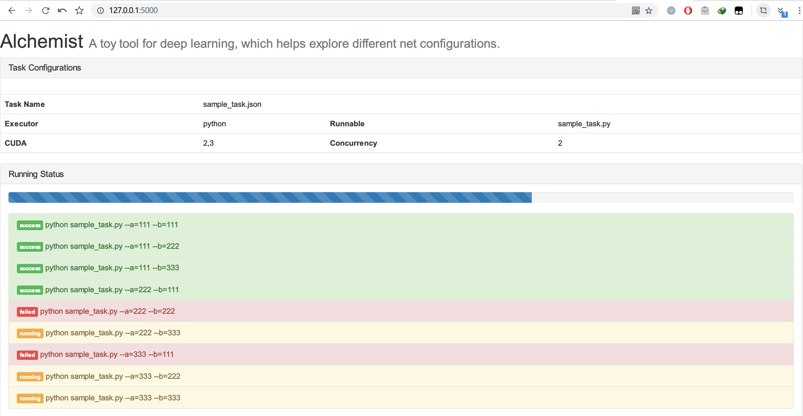

# Manytasks

A tool for deploying many tasks automatically.

## Installation

The simplest way to install the package is:

`pip install manytasks`

or you can install from github to get the newest features:

`pip install git+https://github.com/dugu9sword/manytasks.git`


## Usage

- Configuration

A sample ManyTasks configuration is stored in `sample_config.hjson`.

You can create a config by `manytasks init`

- Running

You can run many tasks by `manytasks run sample_config`.

- Enable Web UI

You can view the running status via "http://127.0.0.1:5000" (**the port number may differs**, you can get the port number from the command line) by running: `manytasks sample_config --ui`



- Results

All running logs are stored in `sample_config.logs`. You can click the item in the list to view the last 100 lines of the log.

The running log of the manytasks is written into `sample_config.logs/status.txt` 

The IO stream of tasks (e.g. `print()`, `Exception`, `Error`, ...) are redirected to `sample_config.logs/task-[index].txt`.

## Sample Configuration

```
{
  "executor": "python some.py",    # runnable
  "cuda": [0, 1],                  # [-1 if not using cuda] cuda index to use
  "concurrency": 2,                # number of multi-processes 
  "configs": {
    "==base==": [                  # basic configurations
      "--word-emb", [50, 100],
      "--learning-rate", "{range(0.001, 0.1, 0.001)}"
    ],
    "==more==": []
  }
}
```

## History

**2021.3.16**, Support for JSON rule.

**2021.2.18**, Big changes.

- [x] Support Non-key arguments
- [x] Support for setting latency between two tasks (sometimes task-2 may reuse the cached data generated by task-1, so it is a good idea to let task-2 wait for a few seconds) 
- [x] Remove the arg `runnable` and merge it into `executor`
- [x] Support for result extraction

**2020.12.12**, Big changes! I will resubmit my paper to ACL 2021 recently. Before that, I want to publish this repo to `pypi` so that you can install it by `pip install ...` directly. I rename `alchemist` to `manytasks` to make the name of the tool easier to recognize, and change the description *A toy tool for deep learning, which helps explore different net configurations.* to *A tool for deploying many tasks automatically.*

- [x] Colorize the CLI tools
- [x] Disable the web UI by default
- [x] Support for configuration with python script
- [x] Support for init a config
- [x] Support for showing the results

**2019.12.11**, About one year later, after submitting my ACL 2020 paper, I add some new features to the tool. Good luck~

- [x] Use `.hjson` (<https://hjson.org/>) instead of `.json` for configuration, since `.hjson` is more human-readable which allows comments and missing/trailing commas
- [x] Ask the user for overriding existing logs
- [x] Beautify the CLI tools

**2019.1.1**, First version comes out. I wrote the code to enable grid search for my ACL 2019 submission. Unfortunately it was rejected. :(

- [x] Enumerate different configurations
- [x] Specify which GPU card to use
- [x] Specify the number of processes
- [x] Web UI support
- [x] Show the last 100 lines of logs
- [x] Show the GPU overload
