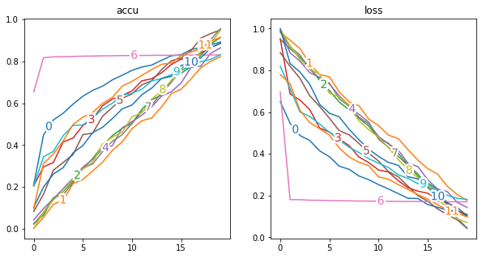
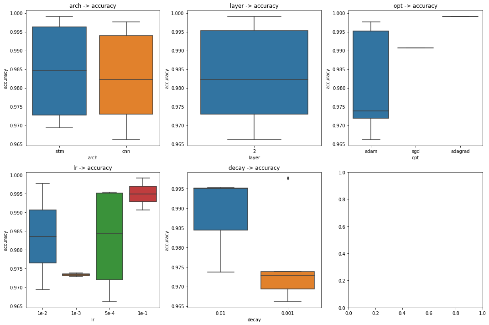

# Manytasks

A lightweight tool for deploying many tasks automatically, without any modification to your code.

* [Manytasks](#manytasks)
   * [Publications Using this Tool](#publications-using-this-tool)
   * [Installation](#installation)
   * [Quick Example](#quick-example)
   * [Sample Configuration](#sample-configuration)
   * [Advanced Usage](#advanced-usage)
   * [Design Philosophy](#design-philosophy)
   * [History](#history)


## Publications Using this Tool

- **Arxiv 2020**: *Chinese Named Entity Recognition Augmented with Lexicon Memory*. 
- **ACL 2020**: *Evaluating and Enhancing the Robustness of Neural Network-based Dependency Parsing Models with Adversarial Examples*. 
- **ACL 2021**: *Defense against Synonym Substitution-based Adversarial Attacks via Dirichlet Neighborhood Ensemble*.
- **WMT 2021**: *The Volctrans GLAT System: Non-autoregressive Translation Meets WMT21*.
- **EMNLP 2021**: *On the Transferability of Adversarial Attacks against Neural NLP Models*. 
- **EMNLP 2021**: *Searching for an Effiective Defender: Benchmarking Defense against Adversarial Word Substitution*. 


## Installation

I **recommend** you install from github to get the newest features:

`pip install git+https://github.com/dugu9sword/manytasks.git` 

You can also install the package (**maybe outdated**) from pypi:

`pip install manytasks [not recommended]` 


## Quick Example

```
cd examples/python

# configuration is stored in tasks.json
manytasks run tasks
```

All running logs are stored in `tasks.logs`. 

- The running log of the manytasks is written into `task.logs/status.txt` 

- The IO stream of tasks (e.g. `print()`, `Exception`, `Error`, ...) are redirected to `task.logs/task-[index].txt`.


## Sample Configuration

For more details, see `examples/advanced_configs`.

```python
{
  # any runnable program, python/perl/bash/java, etc. 
  "executor": "python some.py",    
  # When cuda is set to -1/[]/[-1], ManyTasks will not set 
  # the environment variable CUDA_VISIBLE_DEVICES. 
  "cuda": [0, 1],
  # How many processes will be run in parallel?
  #     - "#CPU" (number of CPUs)
  #     - "#CUDA" (number of CUDA devices)
  #     - an integer  
  "concurrency": 2,
  "configs": {
    # basic configurations
    "==base==": [          
      # an arg without a key
      "arg0",
      # a list of values
      "--a", [50, 100],
      # use "{PYTHON SCRIPTS}" to produce a list
      "-b", "{range(10)}",
      # use "<...[key]...>" to refer to an arg
      "--name", "<a_[--a]_b_[-b]>"
    ],
    # more disjoint configurations
    "==more==": [
      # case 1
      [
        "--c1", 1
      ],
      # case 2
      [
        "--c1", 2
        "--c2", [3, 4]
      ],
    ]
  }
}
```

which yields:
```bash
python some.py arg0 --a 50 --b 0 --name a_50_b_0 --c1 1
python some.py arg0 --a 50 --b 0 --name a_50_b_0 --c1 2 --c2 3
python some.py arg0 --a 50 --b 0 --name a_50_b_0 --c1 2 --c2 4

python some.py arg0 --a 50 --b 1 --name a_50_b_0 --c1 1
python some.py arg0 --a 50 --b 1 --name a_50_b_0 --c1 2 --c2 3
python some.py arg0 --a 50 --b 1 --name a_50_b_0 --c1 2 --c2 4
...
```

## Advanced Usage


- Result Extraction

You can extract results (`accuracy`, `F-1`, `BLEU`, etc. ) from generated logs by writing simple rules. 

Try: 

`manytasks show tasks --rule rule`

where the `rule.yaml` looks like:

```yaml
bleu:
  filters:
    include: valid on 'valid' subset
  pattern: bleu <FLOAT>
  reduce: max
loss:
  filters:
    include: valid on 'valid' subset
  pattern: loss (\d*.\d*)
  reduce: min
```

You will get:

```
  idx  cmd                                                                                      bleu      loss
-----  -----------------------------------------------------------------------------------  --------  --------
    0  python main.py wmt14 --arch lstm --layer 2 --opt adam --lr 1e-2 --decay 0.01         nan       nan
    1  python main.py wmt14 --arch lstm --layer 2 --opt adam --lr 5e-4 --decay 0.01          25.2239    0.1586
    2  python main.py wmt14 --arch transformer --layer 2 --opt adam --lr 1e-2 --decay 0.01   19.8578    0.3370
    3  python main.py wmt14 --arch transformer --layer 2 --opt adam --lr 5e-4 --decay 0.01   21.1514    0.2932
    4  python main.py wmt14 --arch lstm --layer 2 --opt sgd --lr 1e-1                       nan       nan
    5  python main.py wmt14 --arch lstm --layer 2 --opt adagrad --lr 1e-1                    21.8467    0.2697
    6  python main.py wmt14 --arch transformer --layer 2 --opt sgd --lr 1e-1                 16.8448    0.4381
    7  python main.py wmt14 --arch transformer --layer 2 --opt adagrad --lr 1e-1             17.8604    0.4042
```

- Plotting Curves

See `examples/python/analyze_log.ipynb` for details.



- Factor Analsis

See `examples/python/analyze_log.ipynb` for details.



## Design Philosophy

**Q**: Why not use other open-source tools for hyper-parameter tuning, such as `optuna`, `hydra`, `wandb`?

**A**: The first time I developed this tool is 2019-1-1, when most of those tools (except `optuna`) were **not born** yet. What's more, 

- These tools are **heavy**, which means:
    - You need to modify your code (add several lines of `import xxx; xxx.foo(); xxx.bar();`) to integrate their functionalities.
    - You may have to replace your `print(...)` or `log(...)` function with theirs, sometimes your results may be logged to their server. 
    - These tools are highly binded with `python`, which means they may fail if your code is written in `perl` (such as `mosetokenizer` in machine translation), `bash` (such as your code for preprocessing), etc.
- `manytasks` is a lightweight tool which helps you deploy many tasks **without any modification** to your code, all logs will be saved in your machine.

**Q**:When should you use other open-source tools for hyper-parameter tuning, such as `optuna`, `hydra`, `wandb`?

**A**: For complex cases when you would like to enjoy their power of hyper-parameter tuning.


## History

**2021.11.8**, Small changes.

- [x] Code refactoring, bugfix, more examples.
- [x] Better support for arg reference (substring, key-based reference).

**2021.10.3**, Big changes. Code refactoring, the architecture changes a lot.

- [x] Better support for log extraction with `yaml` rule file.
- [x] Better support for log analysis with `extract()` from `manytasks.log_extractor`.
- [x] Remove support for extracting results with python scripts.


**2021.9.26**, Big changes.

- [x] Code refactoring.
- [x] Add support for setting timeout for each task.
- [x] Add support for arg reference.
- [x] Add support for showing PID of a task.

**2021.9.13**, Small changes.

- [x] Add support for specifying an output directory.
- [x] Add better support for log analysis.

**2021.6.20**, Big changes.

- [x] Deprecate support for WebUI.
- [x] Add support for resuming from the last running status.
- [x] Add support for factor analysis.

**2021.5.26**, Small changes.

- [x] Add support for yaml rule & Deprecate support for json rule (regex in json is not readable)

**2021.3.16**, Small changes.

- [x] Support for JSON rule.
- [x] Beautify the command line output.

**2021.2.18**, Big changes.

- [x] Support Non-key arguments
- [x] Support for setting latency between two tasks (sometimes task-2 may reuse the cached data generated by task-1, so it is a good idea to let task-2 wait for a few seconds) 
- [x] Remove the arg `runnable` and merge it into `executor`
- [x] Support for result extraction

**2020.12.12**, Big changes! I will submit my paper to ACL 2021 recently (accepted!). Before that, I want to publish this repo to `pypi` so that you can install it by `pip install ...` directly. I rename `alchemist` to `manytasks` to make the name of the tool easier to recognize, and change the description *A toy tool for deep learning, which helps explore different net configurations.* to *A tool for deploying many tasks automatically.*

- [x] Colorize the CLI tools
- [x] Disable the web UI by default
- [x] Support for configuration with python script
- [x] Support for init a config
- [x] Support for showing the results

**2019.12.11**, About one year later, after submitting my ACL 2020 paper (accepted!), I add some new features to the tool. Good luck~

- [x] Use `.hjson` (<https://hjson.org/>) instead of `.json` for configuration, since `.hjson` is more human-readable which allows comments and missing/trailing commas
- [x] Ask the user for overriding existing logs
- [x] Beautify the CLI tools

**2019.1.1**, First version comes out. I wrote the code to enable grid search for my ACL 2019 submission. Unfortunately it was rejected. :(

- [x] Enumerate different configurations
- [x] Specify which GPU card to use
- [x] Specify the number of processes
- [x] Web UI support
- [x] Show the last 100 lines of logs
- [x] Show the GPU overload
